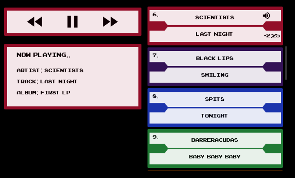

# Vue Jukebox

[](https://hub.docker.com/r/mimicmobile/flask-vue-jukebox/)
[](https://hub.docker.com/r/mimicmobile/flask-vue-jukebox/)
[](https://hub.docker.com/r/mimicmobile/flask-vue-jukebox/)
[](https://microbadger.com/images/mimicmobile/flask-vue-jukebox "Get your own image badge on microbadger.com")
[](https://microbadger.com/images/mimicmobile/flask-vue-jukebox "Get your own commit badge on microbadger.com")


`vue-jukebox` is a project that is part web component jukebox and part Python backend service.

It can be used as either a standalone web component or as a vue component

## Features
- Run directly as a web component in any project, vue or otherwise.
- Encode mp3 links to help obfuscate
- Randomize list of songs
- Keyboard shortcuts to control playback (right, left, space)

## Screenshots
<a href="screenshot.png"></a>

## TODO
- Instantiate component with configuration props
- Customize colors, logo and background, etc
- Allow JSON path to be provided for users not intending to use backend service

## Web component 
The web component can be loaded into your project by including the required dependencies and the juke-box element itself.
```html
<!DOCTYPE html>
<html lang="en">
    <head>
      <meta charset="UTF-8">
      <title>vue-jukebox</title>

      <style>
        @font-face {
          font-family: 'Arcade';
          src: url('/static/fonts/arcade_classic.ttf') format('truetype');
        }

        @font-face {
          font-family: 'Material Icons';
          font-style: normal;
          font-weight: 400;
          src: local('Material Icons'), local('MaterialIcons-Regular'), url('/static/fonts/material-icons.woff2') format('woff2');
        }

        html {
          background-color: #000;
        }
      </style>
    </head>
    <body>
        <juke-box></juke-box>

        <script type="text/javascript" src="https://unpkg.com/@webcomponents/webcomponentsjs@2.3.0/webcomponents-loader.js"></script>
        <script type="text/javascript" src="https://unpkg.com/vue@2.6.10/dist/vue.runtime.min.js"></script>
        <script type="text/javascript" src="/juke-box.min.js"></script>
    </body>
</html>

```
### Getting started
You can build a version of the above example HTML file with all the required dependencies by running the `build_wc.sh` script!

#### Steps

Install `@vue/cli` and `@vue/web-component-wrapper`

    npm install -g @vue/cli @vue/web-component-wrapper
Install dependencies

    npm install
Build web component

    ./build_wc.sh
Next copy necessary files and directories from dist/ (`juke-box.min.js` `fonts/` `img/`) into your project.

If embedding in existing project, you use `demo.html` as a "basis".  Make sure to include the required fonts, `juke-box.js`, the jukebox image and optionally the `polyfill webcomponents` javascript library.

## Vue component
TODO

## Backend service
Service can be started in Docker Compose: `docker-compose up` or by running `./start.sh`.  The static volume is by default mounted under `/tmp/vue-jukebox/static/`

### Docker
Optionally modify `server/variables.env` and then build your container
```bash
docker run --rm \
-p 5001:5001 \
-v /tmp/static/:/usr/src/app/static/ \
--env-file server/variables.env \
--name flask-vue-jukebox mimicmobile/flask-vue-jukebox:latest
```

Make sure to provide a static files volume to the container under `/usr/src/app/static`

_You can serve your entire project from the backend service by creating `/usr/src/app/static/index.html`.  Files in /static/ will be served as requested._


## Serving MP3s
Songs should be put in the static files volume/directory under `/usr/src/app/static/mp3s/`

The mp3s directory will automatically create a sqlite db on service start.

## License

    Copyright 2018 Mimic Mobile Limited

    Licensed under the Apache License, Version 2.0 (the "License");
    you may not use this file except in compliance with the License.
    You may obtain a copy of the License at

       http://www.apache.org/licenses/LICENSE-2.0

    Unless required by applicable law or agreed to in writing, software
    distributed under the License is distributed on an "AS IS" BASIS,
    WITHOUT WARRANTIES OR CONDITIONS OF ANY KIND, either express or implied.
    See the License for the specific language governing permissions and
    limitations under the License.
